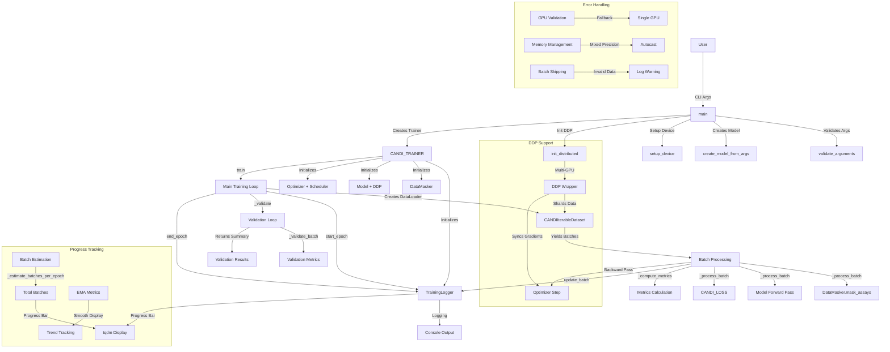

# Design Document

## Overview

The refactored training module implements a modular CANDI_TRAINER class in train.py that replaces the monolithic PRETRAIN class. The new architecture emphasizes separation of concerns, comprehensive logging, and robust error handling. The system supports both single and multi-GPU training with automatic fallback mechanisms. Integration with CANDIIterableDataset from data.py provides efficient data loading with built-in sharding for distributed training.

## Architecture

The system uses a single CANDI_TRAINER class that encapsulates all training logic with the following key components:

- **TrainingLogger**: Centralized logging system with verbosity levels (0, 1, 2) and progress tracking
- **DataMasker**: Handles assay masking for imputation tasks with robust edge case handling
- **CANDI_TRAINER**: Main orchestrator that manages the training pipeline
- **DDP Support**: Automatic detection and graceful fallback for multi-GPU scenarios
- **Batch Progress Tracking**: Real-time estimation and display of training progress

Key integrations:
- data.py for efficient, parallel data loading with CANDIIterableDataset
- torch.distributed for DDP with automatic fallback
- tqdm for progress bars with batch counting
- Comprehensive error handling and logging

## Components and Interfaces

### **Core Classes**

#### **TrainingLogger**
**Purpose**: Centralized logging system with verbosity control and progress tracking
- **Input**: verbosity level (0-2), DDP status, color preferences, warning suppression
- **Output**: Formatted console output, progress bars, metrics display
- **Key Methods**:
  - `start_epoch(epoch, total_epochs, estimated_batches)`: Initialize progress bar with batch counting
  - `update_batch(metrics, loss_dict)`: Update progress and log metrics based on verbosity
  - `end_epoch(validation_summary)`: Close progress bar and display epoch summary
  - `log_error/warning/info(message)`: Centralized logging with warning suppression

#### **DataMasker**
**Purpose**: Handles assay masking for imputation tasks with robust edge case handling
- **Input**: data tensor, metadata, availability mask, number of features to mask
- **Output**: Masked data, updated metadata, updated availability mask
- **Key Methods**:
  - `mask_assays(data, metadata, availability, num_mask)`: Intelligently masks features, handles cases with few available features

#### **CANDI_TRAINER**
**Purpose**: Main orchestrator that manages the entire training pipeline
- **Input**: model, dataset_params, training_params, device, rank, world_size
- **Output**: Trained model, training metrics, validation results
- **Key Methods**:
  - `__init__()`: Initialize trainer with model, dataset, optimizer, scheduler, logger
  - `train()`: Main training loop with epoch management and batch processing
  - `_setup()`: Configure logging, validation, DDP wrapper
  - `_process_batch(batch)`: Apply masking, forward pass, compute loss and metrics
  - `_compute_metrics()`: Calculate R2, Spearman, Pearson correlations, MSE, perplexity
  - `_validate()`: Run validation loop and compute validation metrics
  - `_estimate_batches_per_epoch()`: Calculate expected batches for progress tracking
  - `_adjust_lr_if_needed()`: Monitor progress and adjust learning rate

### **Utility Functions**

#### **DDP Support**
- **init_distributed()**: Initialize distributed training with GPU validation and fallback
- **cleanup_distributed()**: Clean up distributed training resources
- **check_gpu_availability()**: Check available GPUs and provide guidance

#### **Model Creation**
- **create_model_from_args(args, signal_dim)**: Create model based on CLI arguments
- **setup_device(args)**: Configure device (CPU/GPU) with proper error handling

#### **CLI Interface**
- **create_argument_parser()**: Define comprehensive CLI argument parser
- **validate_arguments(args)**: Validate and process CLI arguments
- **main()**: Entry point with argument parsing, model creation, and training orchestration

### **Data Flow**

1. **Initialization**: CLI args → Model creation → Device setup → DDP initialization → Trainer creation
2. **Training Loop**: Dataset setup → Batch estimation → Epoch loop → Batch processing → Validation
3. **Batch Processing**: Data loading → Masking → Forward pass → Loss computation → Metrics → Backward pass
4. **Progress Tracking**: Batch counting → Progress bar → EMA metrics → Epoch summary

### **Interfaces**
- **Dataset**: CANDIIterableDataset yields batches with 'x_data', 'y_data', 'x_meta', 'y_meta', etc.
- **Model**: Forward pass takes inputs and returns predictions for count and p-value data
- **Loss**: CANDI_LOSS computes negative binomial loss for counts and Gaussian NLL for p-values

## Data Models

### **Batch Structure**
- **Input Batch**: `{'x_data': Tensor[B, L, F], 'x_meta': Tensor[B, 4, F], 'x_avail': Tensor[B, F], 'x_dna': Tensor[B, L*25, 4]}`
- **Target Batch**: `{'y_data': Tensor[B, L, F], 'y_meta': Tensor[B, 4, F], 'y_avail': Tensor[B, F], 'y_pval': Tensor[B, L, F], 'y_peaks': Tensor[B, L, F], 'y_dna': Tensor[B, L*25, 4]}`
- **Dimensions**: B=batch_size, L=context_length, F=num_features, 4=metadata_dim, 25=DNA_resolution

### **Metrics Dictionary**
- **Imputation Metrics**: `imp_count_r2_median`, `imp_pval_r2_median`, `imp_count_pearson_median`, etc.
- **Observation Metrics**: `obs_count_r2_median`, `obs_pval_r2_median`, `obs_count_pearson_median`, etc.
- **Loss Dictionary**: `total_loss`, `obs_count_loss`, `imp_count_loss`, `obs_pval_loss`, `imp_pval_loss`

### **Progress Tracking**
- **EMA Metrics**: Exponential moving averages for smooth trend tracking
- **Batch Counting**: Real-time estimation vs actual batch counts
- **Progress Bar**: tqdm integration with percentage completion and time estimates

## Error Handling

### **Robust Error Management**
- **GPU Validation**: Automatic detection of available GPUs with graceful fallback to CPU
- **DDP Fallback**: Automatic fallback to single-GPU when DDP initialization fails
- **Memory Management**: Mixed precision training with autocast to reduce memory usage
- **Batch Skipping**: Intelligent handling of invalid batches with warning logging
- **Data Validation**: Comprehensive validation of input data before processing

### **Error Recovery Strategies**
- **Data Loading Errors**: Skip invalid batches, log warnings, continue training
- **NaN Losses**: Detect and skip backward pass, log error details
- **DDP Sync Issues**: Use dist.barrier() for synchronization, handle rank failures
- **Memory Issues**: Automatic batch size reduction, mixed precision fallback
- **Validation Failures**: Skip validation with fallback metrics, log warnings

### **Logging and Monitoring**
- **Centralized Logging**: All errors, warnings, and info messages through TrainingLogger
- **Verbosity Control**: Configurable logging levels (0=quiet, 1=normal, 2=verbose)
- **Warning Suppression**: Optional suppression of warnings for clean output
- **Progress Monitoring**: Real-time tracking of training progress and metrics

## Testing Strategy

### **Comprehensive Testing Framework**
- **Unit Tests**: Individual component testing for each class and method
  - TrainingLogger verbosity levels and progress tracking
  - DataMasker edge cases and masking logic
  - CANDI_TRAINER batch processing and metrics computation
  - DDP initialization and fallback mechanisms

- **Integration Tests**: End-to-end training pipeline testing
  - Full training loop with CANDIIterableDataset
  - Batch estimation accuracy validation
  - Progress tracking and logging verification
  - Model saving and loading functionality

- **Multi-GPU Tests**: Distributed training validation
  - DDP initialization with various GPU configurations
  - Data sharding and gradient synchronization
  - Automatic fallback to single-GPU scenarios
  - Performance comparison between single and multi-GPU

- **Error Handling Tests**: Robustness validation
  - GPU availability detection and fallback
  - Invalid batch handling and recovery
  - Memory management and mixed precision
  - DDP failure scenarios and recovery

### **Test Coverage Goals**
- **Code Coverage**: 80%+ on new training module code
- **Function Coverage**: All public methods and critical private methods
- **Edge Case Coverage**: Invalid inputs, resource constraints, failure scenarios
- **Performance Coverage**: Training speed, memory usage, GPU utilization

### **Test Data Requirements**
- **Small Dataset**: EIC dataset subset for fast testing
- **Synthetic Data**: Generated data for unit testing
- **Real Data**: Full CANDI dataset for integration testing
- **Edge Cases**: Minimal data scenarios for robustness testing
